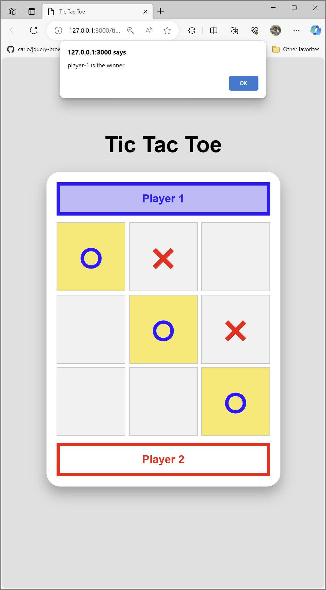

# Tic Tac Toe JavaScript

Ini adalah aplikasi ringkas permainan Tic Tac Toe yang saya bangunkan dengan JavaScript, tanpa sebarang framework seperti React, Vue malahan juga framework frontend seperti Bootstrap ataupun Tailwind.

Aplikasi ini dibangunkan untuk membantu pelajaran JavaScript.

## Demo

Demo boleh dicuba di https://js-tictactoe-1m9.pages.dev/

## Video YouTube

Saya membuat penerangan kepada pembangunan aplikasi ini di pautan YouTube berikut : 

https://youtu.be/rBaf85_AvYk

## Sedikit Penerangan

1. Tetapkan giliran kepada `player-1`
2. 3 peristiwa _(event)_ yang ditunggu
    * pemain `mouseover` pada salah satu kotak
        * pastikan tiada class `checked` sebab menandakan kotak telah ditandakan
        * tambah class tertakluk `player-1` atau `player-2` kepada variable `current_turn`
        * tambah class `temp` sebagai tanda `mouseover`
    * pemain `mouseout` daripada salah satu kotak
        * pastikan tiada class `checked` kerana tidak perlu menghilangkan tanda **x** atau **o** bagi kotak yang telah ditanda pemain
        * sekiranya terdapat class `temp`, buang class `temp` dan `player-1` atau `player-2` tertakluk kepada variable `current_turn`
    * pemain klik _(click)_ pada kotak
        * dapatkan `index` kotak
        * semak sama ada kotak mempunyai class `checked` kerana ianya tidak boleh ditanda semula
        * sekiranya tidak, tambahkan class `checked` dan `player-1` atau `player-2` tertakluk kepada variable `current_turn`
        * semak sama ada pemain telah menang dengan fungsi `check_winner()`
        * sekiranya `check_winner()` adalah `true`
            * umumkan pemenang
            * `reset_game()` 
        * sekiranya `check_winner()` adalah `false`
            * semak sekiranya permainan telah `stalemate` dengan fungsi `check_stalemate()`
                * sekiranya tidak stalemate
                    * laksanakan arahan `update_turn()` untuk tukar giliran
                * sekiranya stalemate
                    * umumkan stalemate
                    * jalankan fungsi `reset_game()`
3. Fungsi-fungsi yang dibangunkan
    * `check_winner()` - menyemak sama ada pemain telah menang.
        * Sekiranya ya 
            * set kotak dengan class `winner`
            * return `true`
        * Sekiranya tidak
            * return `false`
    * `check_stalemate()` - menyemak sama ada semua kotak telah ditandakan
        * Sekiranya ya
            * return `true`
        * Sekiranya tidak
            * return `false`
    * `update_turn()` - menukar nilai current_turn kepada `player-1` atau `player-2`
4. Variable `win` adalah Array yang menyimpan data kombinasi kotak yang diperlukan untuk menang
5. Variable `current_turn` menyimpan nilai `player-1` atau `player-2` yang digunakan sebagai class untuk menunjukkan giliran pemain
